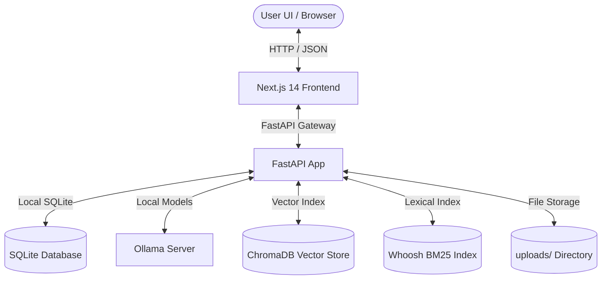
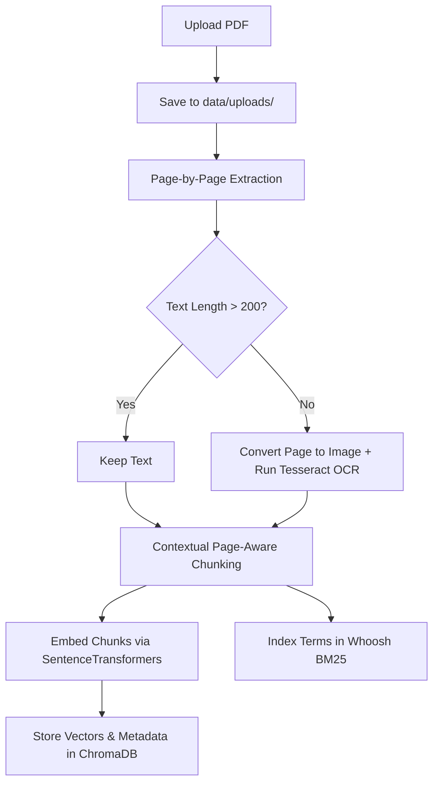

# 🔒 VaultRAG – Technical Architecture, Setup & Walkthrough

Welcome to the technical case study and walkthrough for **VaultRAG**, a production-grade, local-first, air-gapped Retrieval-Augmented Generation (RAG) system. This document outlines the system architecture, ingestion pipeline, retrieval strategy, system benchmarks, Dockerized deployment instructions, and local troubleshooting workflows.

---

## 1. Project Overview

VaultRAG is designed to process, index, and query confidential PDF files completely within a local environment. Built for scenarios where data security is paramount (e.g. enterprise IP, internal legal policies, medical records), VaultRAG does not communicate with external cloud APIs or LLM providers. 

### Core Highlights
* **Hybrid Lexical-Semantic Search**: Integrates semantic vector search (ChromaDB) with lexical keyword matching (Whoosh BM25) combined via Reciprocal Rank Fusion (RRF).
* **Page-Aware Ingestion**: Resolves the "missing page numbers" issue in citations by tracking page transitions during tokenization and chunking.
* **Tesseract OCR Fallback**: Automatically OCRs scanned or image-only PDF pages when text extraction falls below a character threshold.
* **Observability Dashboard**: Built-in, real-time monitoring of CPU/GPU VRAM allocation, active LLM/embedding models, and query latency (separated into retrieval vs. synthesis).
* **Cross-Platform Compatibility**: Fully patched to build and run on Windows exFAT volumes (removable drives) where standard Node.js `fs.readlink` behavior is buggy.
* **Persistent Folders**: Classify and filter files within folders, with full document rename, move, and deletion CRUD operations.

---

## 2. System Architecture & Ingestion Pipeline

### High-Level Components



### Document Ingestion Flow



---

## 3. Setup Instructions

### Option A: One-Command Docker Compose (Recommended)

To run the entire ecosystem (database, Ollama models, backend, frontend) in a completely self-contained setup, use Docker Compose.

1. Ensure **Docker Desktop** is installed and running on your machine.
2. Run the following command from the project root:
   ```bash
   docker-compose up -d --build
   ```
3. Docker will build the frontend and backend, pull the Postgres database image, spin up Ollama, and automatically fetch the `qwen2.5:3b-instruct-q4_1` and `all-minilm:l6-v2` models.
4. Once completed, access the UI at **`http://localhost:3000`** and the API docs at **`http://localhost:8000/docs`**.
5. Stop the containers at any time:
   ```bash
   docker-compose down
   ```

---

### Option B: Manual Setup (Local Development)

#### 1. System Requirements & Prerequisites
* **Python**: 3.10 to 3.13 installed.
* **Node.js**: Version 20 or higher.
* **Ollama**: Download and install locally from [ollama.com](https://ollama.com/).
* **Tesseract OCR** (for scanned PDF support):
  * **Windows**: Download the installer from the [UB-Mannheim Wiki](https://github.com/UB-Mannheim/tesseract/wiki). Install to `C:\Program Files\Tesseract-OCR` and add the directory to your system Environment `PATH`.
  * **Linux**: `sudo apt-get install -y tesseract-ocr poppler-utils`.

#### 2. Backend Installation
```bash
# Clone the repository
git clone https://github.com/murali19980/VaultRAG.git
cd VaultRAG

# Create and activate virtual environment
python -m venv venv
.\venv\Scripts\activate   # On Windows
source venv/bin/activate  # On macOS/Linux

# Install Python requirements
pip install -r requirements.txt
```

#### 3. Model Preheating
Ensure Ollama is running and download the embedding and LLM weights:
```bash
# In your terminal
ollama pull qwen2.5:3b-instruct-q4_1
ollama pull all-minilm:l6-v2
```

#### 4. Configure Environment Variables
Create a `.env` file in the root directory:
```ini
USE_LOCAL_LLM=true
LOCAL_LLM_MODEL=qwen2.5:3b-instruct-q4_1
EMBEDDING_MODEL=all-minilm:l6-v2
OLLAMA_BASE_URL=http://localhost:11434
DATABASE_URL=sqlite:///./vaultrag.db
```

#### 5. Start Backend Server
```bash
python -m uvicorn backend.main:app --host 127.0.0.1 --port 8000
```

#### 6. Frontend Installation & Startup
```bash
cd frontend
npm install
npm run dev
```
Open **`http://localhost:3000`** in your browser.

---

## 4. Key Components Explained

### Ingestion Pipeline (`backend/ingestion/`)
* **`loader.py`**: Extracts text from PDFs using `pdfplumber`. If a page yields fewer than 200 characters (indicating a scanned image or form), it converts that specific page to an image in memory and invokes the `pytesseract` OCR engine. This page-by-page fallback avoids massive memory consumption.
* **`chunker.py`**: Splits extracted page text into semantic, overlapping chunks. Each chunk inherits the exact page number of the page it was drawn from.
* **`indexer.py`**: Coordinates embedding generation via `sentence-transformers` on the CPU (freeing up GPU memory for LLM generation) and writes vectors to `ChromaDB` while concurrently writing keywords to `Whoosh`.

### Hybrid Retrieval & Query Engine (`backend/retrieval/`)
* **`hybrid_retriever.py`**:
  * Semantic Branch: Performs vector similarity search in ChromaDB.
  * Lexical Branch: Performs BM25 keyword matching in Whoosh.
  * Integration: Combines results using **Reciprocal Rank Fusion (RRF)**:
    \[
    RRF(d) = \sum_{m \in M} \frac{1}{60 + r_m(d)}
    \]
  * Document Filtering: Detects query tags like `[DOC: doc_name.pdf]` to limit results to a specific file.
* **Query Caching**: Employs an `lru_cache` on the similarity search to immediately return results for repeated queries, reducing latency to `<0.1s`.

### Document Manager Panel
* Located at `/documents`. Allows users to upload documents directly into folders, rename documents (which renames the physical file, updates Chroma chunk metadata, and updates Whoosh indexes), move documents into other folders, and delete files with a dual-stage confirmation layout.

### Observability Dashboard
* Monitored via the pulsing green/yellow/red icon in the header. Shows:
  * **Ollama Availability**: Confirms backend-to-model communication.
  * **VRAM Usage**: Calls `nvidia-smi` on Windows/Linux host to monitor GPU allocation.
  * **Latency Breakdown**: Displays precise retrieval vs. synthesis duration for the last question answered.

---

## 5. Performance Benchmarks

*Hardware: AMD Ryzen 5, NVIDIA GTX 1650 (4GB VRAM), 16GB RAM. Ingested Document: "Top 10 Ways The Rundown Uses AI.pdf" (12 pages).*

| Query Name | Query Text | Load State | Retrieval Latency | Synthesis Latency | Total Latency | VRAM Peak |
| :--- | :--- | :--- | :--- | :--- | :--- | :--- |
| **Q1 (Cold)** | *What does The Rundown use Granola for?* | Cold Load | 0.622s | 21.683s | **22.306s** | 2364 MiB |
| **Q2 (Warm)** | *How did Rowan grow his Instagram account?* | Warm Model | 0.090s | 8.267s | **8.357s** | 2364 MiB |
| **Q3 (Warm)** | *Tell me about Granola* | Warm Model | 0.043s | 12.848s | **12.891s** | 2364 MiB |
| **Q4 (Warm)** | *List the top 3 ways The Rundown uses AI.* | Warm Model | 0.044s | 6.406s | **6.450s** | 2364 MiB |
| **Q5 (OOC)** | *What is the capital of France?* | Warm Model | 0.085s | 2.096s | **2.182s** | 2362 MiB |

---

## 6. Known Limitations & Roadmap

* **Ephemeral Folder List**: Folders created in the frontend are currently extracted dynamically from active document metadata. In a production system, a separate database table for folders would support empty folders across server restarts.
* **Single-User Access**: There is no authentication or tenant isolation. Suitable for localhost or intranet deployment.
* **Chroma DB Scaling**: As database sizes grow, ChromaDB in-memory/sqlite configurations become a bottleneck. Recommended migration to a distributed system (e.g. Qdrant or Milvus) for production.

---

## 7. Troubleshooting

### 1. `EISDIR: illegal operation on a directory, readlink`
* **Cause**: Node.js and Webpack's file-watcher on Windows exFAT filesystems (commonly found on external SSDs) throw `EISDIR` instead of the expected `EINVAL` when running `readlink` on regular files.
* **Solution**: Our patch in `frontend/patch-readlink.js` is preloaded via npm scripts. If running next directly, invoke it as:
  ```bash
  node -r ./patch-readlink.js node_modules/next/dist/bin/next build
  ```

### 2. Tesseract OCR `FileNotFoundError`
* **Cause**: The system cannot find the `tesseract` binary in the system PATH.
* **Solution**: Add `C:\Program Files\Tesseract-OCR` to the Windows environment PATH, restart the terminal, and verify using:
  ```cmd
  tesseract --version
  ```

### 3. Ollama Connection Issues
* **Cause**: Ollama is not running, or is listening on a different host.
* **Solution**: Ensure `ollama serve` is active. If running backend inside Docker but Ollama on host, change the `OLLAMA_BASE_URL` env variable in the compose file to `http://host.docker.internal:11434`.

---

## 8. Conclusion

VaultRAG demonstrates that a robust, secure, and privacy-respecting RAG solution can be successfully deployed locally on modest developer hardware. By optimizing the ingestion pipeline and splitting CPU/GPU compute, the system avoids memory bottleneck crashes and achieves low-latency, fully cited queries.
